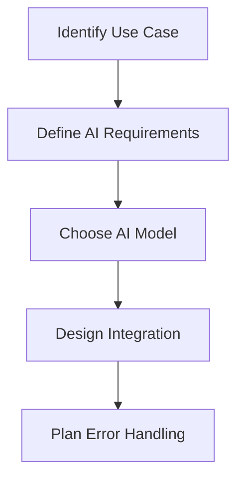

# Introduction to AI Development

Artificial Intelligence is no longer a futuristic concept - it's a practical tool that developers can integrate into applications today. This section will teach you how to leverage AI, particularly ChatGPT and similar models, to build intelligent applications.

## 🤖 What is AI Development?

AI Development involves:
- **Prompt Engineering**: Crafting effective instructions for AI models
- **API Integration**: Connecting your apps to AI services
- **AI-Powered Features**: Building smart, responsive applications
- **Ethical AI**: Understanding limitations and responsible usage

## 🎯 Why Learn AI Development?

### Market Demand
- AI skills are among the highest-paid in tech
- Companies are actively seeking AI integration expertise
- Growing demand for AI-powered applications

### Career Benefits
- Future-proof your development skills
- Command higher rates for AI projects
- Position yourself as a modern developer

### Innovation Opportunities
- Build applications that were impossible before
- Create personalized user experiences
- Automate complex decision-making processes

## 🧠 Types of AI We'll Cover

### 1. Large Language Models (LLMs)
- **ChatGPT/GPT-4**: Text generation and understanding
- **Claude**: Advanced reasoning and analysis
- **LLaMA**: Open-source alternatives

### 2. AI APIs
- **OpenAI API**: Access to GPT models
- **Google AI**: Various AI services
- **Hugging Face**: Open-source models

### 3. AI Integration Patterns
- **Chat Interfaces**: Conversational applications
- **Content Generation**: Automated writing and creation
- **Data Analysis**: AI-powered insights
- **Image Generation**: Visual AI applications

## 🛠️ Core Concepts

### Prompt Engineering
The art of writing effective instructions for AI models:

```javascript
// Basic prompt
const basicPrompt = "Write a blog post about React Native";

// Advanced prompt with structure
const advancedPrompt = `
Write a blog post about React Native with the following requirements:
- Target audience: beginner developers
- Length: 800-1000 words
- Include code examples
- Cover setup, basic components, and deployment
- Use a friendly, encouraging tone
`;

// Prompt with examples (few-shot learning)
const fewShotPrompt = `
Convert the following user requests into API calls:

User: "Show me all users"
API: GET /api/users

User: "Create a new user named John"
API: POST /api/users {"name": "John"}

User: "Delete user with ID 123"
API: DELETE /api/users/123

User: "${userRequest}"
API: `;
```

### API Integration
Connecting your applications to AI services:

```javascript
// OpenAI API integration
import OpenAI from 'openai';

const openai = new OpenAI({
  apiKey: process.env.OPENAI_API_KEY,
});

const generateResponse = async (prompt) => {
  try {
    const response = await openai.chat.completions.create({
      model: "gpt-4",
      messages: [{ role: "user", content: prompt }],
      max_tokens: 1000,
      temperature: 0.7,
    });
    
    return response.choices[0].message.content;
  } catch (error) {
    console.error('AI API Error:', error);
    throw error;
  }
};
```

### Error Handling
Robust error handling for AI services:

```javascript
const safeAICall = async (prompt, retries = 3) => {
  for (let i = 0; i < retries; i++) {
    try {
      return await generateResponse(prompt);
    } catch (error) {
      if (i === retries - 1) {
        // Final attempt failed
        return "I'm having trouble connecting to my AI services. Please try again later.";
      }
      
      // Wait before retrying
      await new Promise(resolve => setTimeout(resolve, 1000 * (i + 1)));
    }
  }
};
```

## 🚀 AI Applications You'll Build

### 1. ChatGPT Clone
- Real-time chat interface
- Conversation history
- Multiple AI models
- Custom system prompts

### 2. Content Generator
- Blog post generator
- Social media content
- Email templates
- Code documentation

### 3. AI Assistant
- Task automation
- Data analysis
- Decision support
- Personalized recommendations

### 4. Smart Forms
- Intelligent form filling
- Data validation
- Auto-completion
- Natural language input

## 📊 AI Development Workflow

### 1. Planning Phase


### 2. Development Phase
1. **Setup**: Configure API keys and services
2. **Integration**: Connect AI to your application
3. **Testing**: Verify responses and edge cases
4. **Optimization**: Improve performance and cost

### 3. Deployment Phase
1. **Security**: Protect API keys and data
2. **Monitoring**: Track usage and costs
3. **Scaling**: Handle increased demand
4. **Maintenance**: Update models and prompts

## 🔧 Essential Tools

### Development Tools
- **Postman**: API testing
- **VS Code Extensions**: AI development helpers
- **Git**: Version control for prompts
- **Environment Variables**: Secure API key storage

### Monitoring Tools
- **OpenAI Dashboard**: Usage tracking
- **Custom Analytics**: Response quality monitoring
- **Error Tracking**: Issue identification
- **Cost Management**: Budget control

### Testing Tools
- **Jest**: Unit testing for AI functions
- **Mock Services**: Simulate AI responses
- **A/B Testing**: Compare prompt variations
- **User Testing**: Real-world feedback

## 💰 Cost Management

### Understanding AI API Costs
- **Tokens**: Basic unit of text processing
- **Models**: Different pricing tiers
- **Usage**: Pay-per-request vs. subscriptions
- **Optimization**: Reducing unnecessary calls

### Cost Optimization Strategies
```javascript
// Caching AI responses
const cache = new Map();

const getCachedResponse = async (prompt) => {
  const cacheKey = prompt.trim().toLowerCase();
  
  if (cache.has(cacheKey)) {
    return cache.get(cacheKey);
  }
  
  const response = await generateResponse(prompt);
  cache.set(cacheKey, response);
  return response;
};

// Batch processing
const batchProcess = async (prompts) => {
  const responses = await Promise.all(
    prompts.map(prompt => generateResponse(prompt))
  );
  return responses;
};
```

## 🛡️ Security Considerations

### API Key Protection
```javascript
// Never hardcode API keys
// ❌ BAD
const openai = new OpenAI({ apiKey: "sk-..." });

// ✅ GOOD
const openai = new OpenAI({ 
  apiKey: process.env.OPENAI_API_KEY 
});

// ✅ EVEN BETTER (with validation)
const apiKey = process.env.OPENAI_API_KEY;
if (!apiKey) {
  throw new Error('OpenAI API key not configured');
}
const openai = new OpenAI({ apiKey });
```

### Data Privacy
- **PII Detection**: Identify and protect personal information
- **Data Sanitization**: Clean inputs before sending to AI
- **User Consent**: Inform users about AI usage
- **Compliance**: Follow GDPR and other regulations

## 🎓 Learning Path

### Week 1: AI Fundamentals
- Understanding AI models and capabilities
- Setting up development environment
- Basic API integration
- Error handling patterns

### Week 2: Prompt Engineering
- Writing effective prompts
- Few-shot learning techniques
- Prompt templates and patterns
- Testing and optimization

### Week 3: Application Development
- Building chat interfaces
- Content generation features
- User experience design
- Performance optimization

### Week 4: Advanced Topics
- Multi-model integration
- Custom AI workflows
- Security and compliance
- Production deployment

## 🔗 Resources

### Official Documentation
- [OpenAI API Documentation](https://platform.openai.com/docs)
- [Google AI Platform](https://cloud.google.com/ai)
- [Hugging Face](https://huggingface.co/docs)

### Learning Resources
- [Prompt Engineering Guide](https://www.promptingguide.ai/)
- [AI for Developers](https://www.deeplearning.ai/ai-for-developers/)
- [Machine Learning for Developers](https://ml-for-developers.com/)

### Community
- [OpenAI Community Forum](https://community.openai.com/)
- [Reddit: r/MachineLearning](https://www.reddit.com/r/MachineLearning/)
- [Discord: AI Development](https://discord.gg/ai-development)

---

**Ready to build intelligent applications?** Let's dive into prompt engineering in the next section! 🚀
