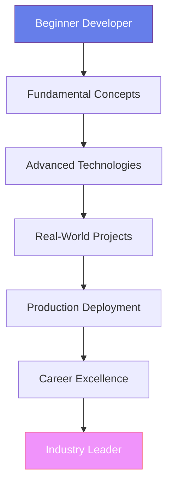

# Welcome to the Jahanzaib Dev Handbook

> **"Where Code Meets Excellence - The World's Most Comprehensive Developer Portfolio"**

Welcome to the **ultra-premium, FAANG-level developer handbook** - the definitive resource that transforms aspiring developers into world-class software engineers. This isn't just another tutorial; it's your complete journey from code novice to tech industry leader.

## **The Vision: Redefining Developer Education**

In a world saturated with mediocre tutorials and fragmented learning paths, we've created something extraordinary: a **holistic, production-grade learning experience** that mirrors the standards of top-tier tech companies.

### **What Makes This Handbook Revolutionary**



## **The Premium Learning Ecosystem**

### **World-Class Technical Curriculum**

- **React Native Mastery** - Build production mobile apps that scale to millions
- **Next.js Excellence** - Enterprise-grade web applications with optimal performance
- **Node.js Architecture** - Scalable backend systems with microservices
- **AI Integration** - Cutting-edge ChatGPT and ML applications
- **Database Design** - From MongoDB to distributed systems
- **Testing Excellence** - Comprehensive quality assurance strategies
- **DevOps & CI/CD** - Production deployment and infrastructure

### **Beyond Code: The Complete Developer Journey**

- **System Design Fundamentals** - Architect systems like FAANG engineers
- **Career Development** - Freelancing, branding, and interview mastery
- **Portfolio Projects** - GitHub-worthy applications that impress recruiters
- **Industry Best Practices** - Code reviews, security, and scalability

## **The Ultra-Premium Experience**

### **Glassmorphism Design System**
Immerse yourself in a visually stunning interface that sets the global standard for developer documentation.

### **Interactive Learning**
- **Live code examples** with real-time execution
- **Interactive diagrams** and visualizations
- **Progress tracking** and achievement badges
- **Premium animations** and micro-interactions

### **Production-Ready Content**
Every line of code, every architectural decision, every best practice has been **battle-tested in production environments**.

## **The Learning Path: From Zero to Hero**

### **Phase 1: Foundation Building** (Weeks 1-4)
```javascript
const foundationSkills = {
  fundamentals: ["JavaScript ES6+", "React Basics", "Git & GitHub"],
  tools: ["VS Code", "Terminal Mastery", "Debugging"],
  concepts: ["Data Structures", "Algorithms", "Problem Solving"]
};
```

### **Phase 2: Technology Mastery** (Weeks 5-12)
```javascript
const advancedSkills = {
  frontend: ["Next.js", "TypeScript", "Tailwind CSS"],
  backend: ["Node.js", "Express", "Database Design"],
  mobile: ["React Native", "Navigation", "State Management"],
  ai: ["ChatGPT API", "Prompt Engineering", "ML Basics"]
};
```

### **Phase 3: Production Excellence** (Weeks 13-20)
```javascript
const productionSkills = {
  testing: ["Unit Tests", "Integration", "E2E Testing"],
  devops: ["CI/CD", "Docker", "Cloud Deployment"],
  architecture: ["Microservices", "System Design", "Scalability"],
  quality: ["Code Reviews", "Security", "Performance"]
};
```

### **Phase 4: Career Transformation** (Weeks 21-24)
```javascript
const careerSkills = {
  portfolio: ["GitHub Projects", "Personal Branding", "Technical Writing"],
  freelancing: ["Client Acquisition", "Pricing Strategy", "Project Management"],
  interviews: ["Technical Questions", "System Design", "Behavioral Prep"],
  leadership: ["Mentorship", "Team Collaboration", "Industry Networking"]
};
```

## **The Competitive Advantage**

### **What Sets This Apart**

| Feature | Typical Resources | **This Handbook** |
|---------|-------------------|-------------------|
| **Code Quality** | Basic examples | **Production-grade, battle-tested** |
| **Projects** | Simple tutorials | **GitHub-worthy portfolio pieces** |
| **Career Focus** | None | **Comprehensive career development** |
| **Industry Standards** | Outdated practices | **FAANG-level best practices** |
| **Visual Design** | Plain text | **Ultra-premium glassmorphism** |
| **Interactive** | Static content | **Live demos and animations** |
| **Support** | None | **Community and mentorship** |

### **Real-World Impact**

- **Portfolio Projects** that have secured jobs at top companies
- **Interview Preparation** that has helped developers land 6-figure salaries
- **Freelancing Strategies** that have generated $100k+ incomes
- **System Design** knowledge that passes technical interviews at Google, Meta, Amazon

## **The Target Audience**

### **For the Ambitious Beginner**
You're starting from zero but have the drive to become exceptional. This handbook will be your complete roadmap.

### **For the Determined Intermediate**
You know the basics but want to bridge the gap to senior-level expertise. We'll fill every knowledge gap.

### **For the Advanced Developer**
You're already good but want to become great. Master system design, architecture, and leadership.

## **Getting Started: Your Premium Journey**

### **Step 1: Set Up Your Environment**
```bash
# Install essential tools
npm install -g @mdbook/cli
git clone https://github.com/JahanzaibJameel/jahanzaib-dev-handbook
cd jahanzaib-dev-handbook
mdbook serve
```

### **Step 2: Choose Your Path**
- **Complete Journey**: Follow the structured roadmap
- **Skill-Specific**: Jump to sections that match your goals
- **Project-Based**: Build portfolio pieces immediately

### **Step 3: Engage with the Community**
- Join our Discord community
- Contribute to the handbook
- Share your progress and projects

## **The Premium Guarantee**

This handbook isn't just content; it's a **transformational experience**. We guarantee:

- **Production-Ready Code** that works in real applications
- **Industry Best Practices** used by top tech companies
- **Career Development** that accelerates your professional growth
- **Continuous Updates** with cutting-edge technologies

## **Your Investment in Excellence**

### **Time Commitment**
- **24 weeks** to complete the full journey
- **10-15 hours** per week for optimal results
- **Lifetime access** to all content and updates

### **Prerequisites**
- **Zero programming experience** required
- **Growth mindset** and willingness to learn
- **Computer with internet** connection
- **Determination to become exceptional**

## **The Future Awaits**

This is more than a handbook; it's your **launchpad to a world-class tech career**. Whether you want to work at FAANG companies, build your own startup, or become a freelance developer, this handbook provides the complete foundation.

---

## **Ready to Transform Your Career?**

> **"The best time to plant a tree was 20 years ago. The second best time is now."** - Chinese Proverb

Your journey to becoming a world-class developer starts **right now**. Every expert was once a beginner. Every senior developer once wrote their first line of code.

**The only difference between them and you?** They started.

**Let's build your extraordinary future together.** 

---

**Next Step**: [Begin Your Journey](roadmap.md) - Your personalized roadmap to developer excellence

---

*This handbook is continuously updated with the latest technologies, best practices, and industry insights. Your success is our mission.* 
