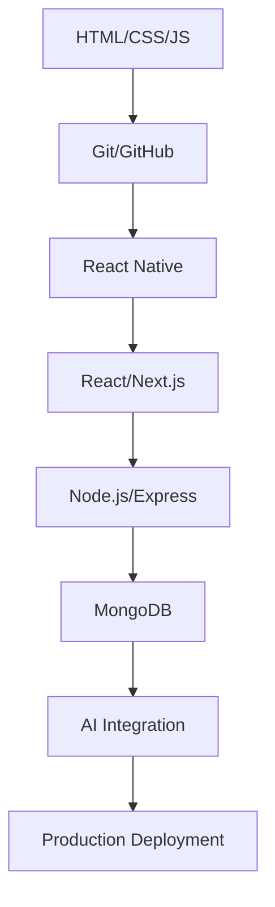

# 12-Month Developer Roadmap

This roadmap takes you from complete beginner to job-ready full-stack developer with AI integration skills.

## 📅 Month-by-Month Breakdown

### Months 1-3: Foundation Fundamentals

**Goal**: Build strong programming fundamentals

#### Month 1: Web Basics
- **HTML5**: Semantic markup, forms, accessibility
- **CSS3**: Layouts, Flexbox, Grid, responsive design
- **JavaScript Basics**: Variables, functions, DOM manipulation
- **Project**: Personal portfolio website
- **Skills**: Structure web pages, style professionally, add interactivity

#### Month 2: JavaScript Mastery
- **Advanced JS**: Arrays, objects, async/await, promises
- **ES6+ Features**: Destructuring, spread, modules
- **DOM & Events**: Event handling, form validation
- **Project**: Interactive web application
- **Skills**: Write clean JavaScript, handle async operations

#### Month 3: Version Control & Tools
- **Git & GitHub**: Branching, merging, pull requests
- **Terminal Basics**: Command line operations
- **Code Quality**: Linting, formatting, debugging
- **Project**: Open source contribution
- **Skills**: Professional development workflow

### Months 4-6: Mobile Development with React Native

**Goal**: Build cross-platform mobile applications

#### Month 4: React Native Fundamentals
- **Setup**: Environment, Expo vs CLI
- **Components**: Core components, custom components
- **Styling**: StyleSheet, responsive design
- **Project**: Simple calculator app
- **Skills**: Build basic mobile interfaces

#### Month 5: Advanced React Native
- **Navigation**: React Navigation setup
- **State Management**: Context API, Redux basics
- **API Integration**: Fetch, Axios, async operations
- **Project**: Weather app with API integration
- **Skills**: Complex app architecture, data flow

#### Month 6: Production React Native
- **Storage**: AsyncStorage, secure storage
- **Performance**: Optimization techniques
- **Testing**: Jest, React Native Testing Library
- **Project**: Full-featured mobile app
- **Skills**: Production-ready mobile development

### Months 7-9: Full-Stack Web Development

**Goal**: Build complete web applications

#### Month 7: Modern Frontend
- **React Fundamentals**: Components, hooks, state
- **Next.js**: Routing, SSR, API routes
- **UI/UX**: Design systems, accessibility
- **Project**: Modern web application
- **Skills**: Professional frontend development

#### Month 8: Backend Development
- **Node.js**: Express, middleware, routing
- **APIs**: REST, GraphQL basics
- **Authentication**: JWT, OAuth, sessions
- **Project**: Complete API backend
- **Skills**: Server-side development, security

#### Month 9: Database & Deployment
- **MongoDB**: Schema design, CRUD operations
- **Full Integration**: Connect frontend to backend
- **Deployment**: Vercel, Render, environment management
- **Project**: Deployed full-stack application
- **Skills**: End-to-end development

### Months 10-12: AI Integration & Career

**Goal**: Build AI-powered applications and launch career

#### Month 10: AI Development
- **Prompt Engineering**: Effective AI prompting
- **ChatGPT API**: Integration, best practices
- **AI Safety**: Ethics, limitations, security
- **Project**: AI-powered application
- **Skills**: Modern AI integration

#### Month 11: Advanced Projects
- **System Design**: Architecture patterns
- **Testing**: Unit, integration, E2E testing
- **Performance**: Optimization, monitoring
- **Project**: Portfolio-worthy application
- **Skills**: Production-grade development

#### Month 12: Career Launch
- **Portfolio**: Curate and showcase projects
- **Freelancing**: Client acquisition, pricing
- **Interview Prep**: Technical and behavioral
- **Personal Branding**: Online presence
- **Skills**: Professional career development

## 🎯 Key Milestones

### Milestone 1: Foundation Complete (Month 3)
✅ Can build static websites  
✅ Understand JavaScript fundamentals  
✅ Use Git professionally  

### Milestone 2: Mobile Developer (Month 6)
✅ Can build cross-platform mobile apps  
✅ Understand mobile app architecture  
✅ Can deploy to app stores  

### Milestone 3: Full-Stack Developer (Month 9)
✅ Can build complete web applications  
✅ Understand database design  
✅ Can deploy production applications  

### Milestone 4: AI-Enhanced Developer (Month 12)
✅ Can integrate AI into applications  
✅ Have professional portfolio  
✅ Ready for career opportunities  

## 📊 Weekly Time Commitment

### Recommended Schedule
- **Weekdays**: 1-2 hours daily
- **Weekends**: 3-4 hours total
- **Total**: 8-12 hours per week

### Daily Breakdown
- **30 min**: Learning new concepts
- **45 min**: Hands-on coding
- **15 min**: Review and documentation

## 🛠️ Technology Stack Timeline

## 📈 Skill Progression

### Technical Skills
1. **Frontend**: HTML → CSS → JavaScript → React → Next.js
2. **Mobile**: React Native → Navigation → State → Testing
3. **Backend**: Node.js → Express → APIs → Database
4. **AI**: Prompting → Integration → Applications → Ethics

### Professional Skills
1. **Development**: Git → Testing → Debugging → Documentation
2. **Architecture**: Components → State → Performance → Security
3. **Career**: Portfolio → Networking → Freelancing → Branding

## 🎯 Success Indicators

### Monthly Checkpoints
- [ ] Can explain concepts clearly
- [ ] Built the monthly project
- [ ] Code is on GitHub
- [ ] Ready for next month's topics

### Final Success Metrics
- [ ] 4+ portfolio projects deployed
- [ ] Can build full applications independently
- [ ] Understand system design principles
- [ ] Ready for freelance/employment opportunities

## 🔄 Adaptation Guidelines

### If You're Behind
- Focus on core concepts, not every detail
- Skip optional projects if needed
- Extend timeline, don't rush fundamentals

### If You're Ahead
- Explore advanced topics
- Build additional projects
- Start freelancing with basic skills
- Contribute to open source

### If You're Stuck
- Review previous months' content
- Join developer communities
- Find a mentor or study partner
- Take breaks, avoid burnout

---

**Remember**: This is a guide, not a rigid rulebook. Adjust based on your learning style, goals, and available time. The key is consistency and practical application! 🚀
